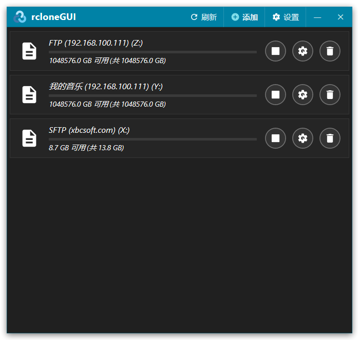
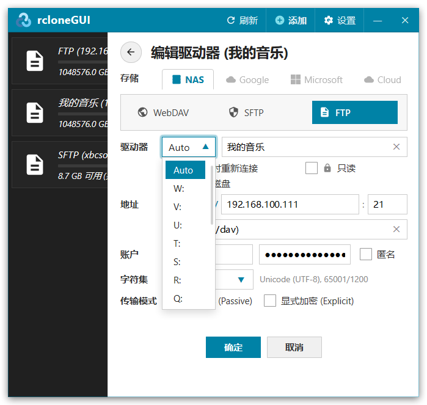
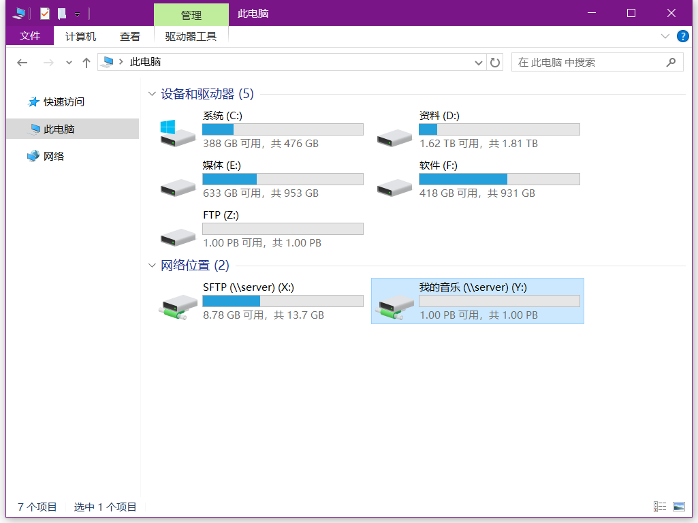
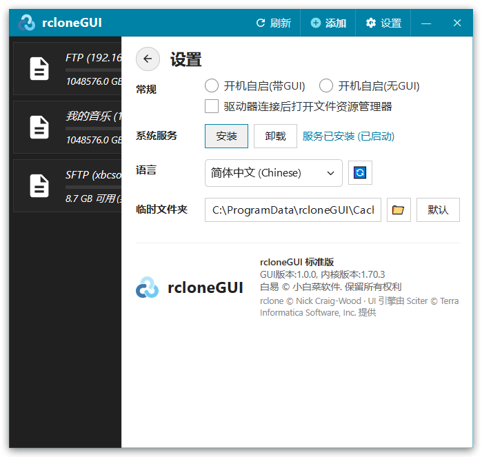

# rcloneGUI

基于 **白易 (BE) + Sciter UI** + **rclone 内核** 开发的轻量、易用 Windows 远程盘符挂载管理工具。

---

## 📖 项目简介

**rcloneGUI** 是一款专为 Windows 用户量身打造的图形化网盘挂载工具。基于 **白易 (BE) C++ 开发框架** 与 **Sciter 现代 UI 引擎** 开发，深度整合功能强大的开源内核 `rclone`，让您可以像管理本地硬盘一样，轻松将 **WebDAV、SFTP、FTP** 等远程存储直接挂载为 Windows 本地磁盘或网络驱动器（如 `Z:`、`Y:`、`X:`）。

无需记忆复杂的命令行参数，开箱即用，支持多盘并发挂载、自动空闲盘符分配、SSH 私钥认证、子目录挂载与开机无感后台（可运行在系统服务层）自动连接。

---

## 🖼️ 界面预览

### 1. 主界面（已挂载列表）
统一管理所有远程驱动器，实时监控可用容量与连接状态，提供一键断开、编辑与删除。



---

### 2. 驱动器配置面板
支持 WebDAV / SFTP / FTP 协议自由切换、自动 `Auto` 盘符分配、远程子路径指定、账号密码及 SSH 私钥认证设置。



---

### 3. Windows 资源管理器原生集成
挂载后的驱动器无缝呈现于“此电脑”中，具备原生磁盘图标与容量条，如同操作本地硬盘一样方便。



---

### 4. 全局设置与系统服务
支持开机自启模式（带 GUI / 纯后台无 GUI 模式、系统服务模式）、多语言无刷新切换、自定义 VFS 缓存路径。



---

## ✨ 核心特性

- 🎨 **白易 (BE) + Sciter 现代界面**：原生 C++ 结合 Sciter HTML/CSS/JS 引擎，极速启动、超低内存开销，自带平滑抽屉滑出动画与环形进度条。
- 🌐 **多协议存储无缝连接**：
  - **WebDAV**：完整支持 HTTP / HTTPS 加密传输及指定 URL 服务端点；
  - **SFTP**：支持密码与 **SSH 独立私钥文件**（`*.pem`、`*.key`、`*.id_rsa`）密钥对免密认证；
  - **FTP / FTPS**：支持标准 FTP、被动模式（Passive）以及显式 TLS 加密（Explicit TLS）。
- 💽 **Windows 原生无缝集成**：
  - 支持挂载为**网络位置（`\\server\<名称>`）**或**本地磁盘**；
  - “此电脑”中实时展示存储容量进度条与可用空间；
  - 双击驱动器卡片直接在资源管理器中打开目标盘符。
- ⚡ **智能盘符管理 (`Auto`)**：
  - 自动向下扫描并分配首个空闲可用盘符（`Z:` ~ `D:`），彻底避免盘符冲突；
  - 亦可手动指定固定盘符。
- 📁 **自由指定挂载子路径**：支持挂载远程服务器上的任意子目录（如 `/music`、`/var/www`、`/dav`），盘符根目录直接呈现目标文件夹内容。
- 🔄 **开机自启与无感后台服务**：
  - 支持开机自动启动 GUI 界面；
  - 支持开机纯后台静默运行（无 GUI，后台自动挂载并维持连接）；
  - 驱动器支持配置“登录时重新连接”。
- 🚀 **高性能 VFS 缓存加速**：支持写回与多线程分块预读缓存策略，保障大文件上传下载与媒体串流播放，支持自定义本地缓存路径。
- 🌍 **多语言支持**：内置**简体中文**与**英文 (English)** 语言包，支持实时无刷新一键切换。

---

## 🚀 快速开始

### 前置要求
* **操作系统**：Windows 7 / Windows 8 / Windows 10 / Windows 11；
* **虚拟磁盘驱动**：需安装 **WinFsp**（仓库发布版中内置，首次挂载若未检测到会自动提示安装）。

### 使用方法
1. 下载最新 Release 压缩包并解压；
2. 运行 `rcloneGUI.exe`；
3. 点击右上角 **`+ 添加`** 按钮；
4. 选择存储协议类型（**WebDAV / SFTP / FTP**），填入服务器地址、端口、路径及账号凭据；
5. 盘符选择 `Auto`（或指定盘符），点击 **确定**；
6. 挂载成功后，即可在“此电脑”中直接访问您的远程存储。


---

## 🛠️ 源码编译与构建

本项目使用 **白易 (BE) C++** 编写宿主程序（最低要求 VS2017+），UI 交互采用 **Sciter (HTML/CSS/JS)** 引擎，内核基于 **rclone v1.70.3** 精简定制。

### 目录结构
```text
rcloneGUI/
├── @myRclone.core.zip         # rclone 内核扩展go源码及构建脚本（已修改精简版构建配置）
├── rcloneGUI/                 # rcloneGUI 主工程
│   ├── BEMod/                 # 白易用户模块目录 (HTTPNative、多线程、系统服务注册等)
│   ├── RcloneService.h        # 挂载服务与核心调度类定义
│   ├── RcloneService.cpp      # 原生 API 与进程通信封装实现
│   ├── common.hpp             # 系统公共工具库
│   ├── 窗口/...                # Win32原生窗口宿主 与 Sciter-JS绑定
│   └── out/                   # 前端资源与输出目录
│       ├── index.html         # Metro UI 主界面结构
│       ├── css/               # 样式定义 (metro.css / index.css)
│       ├── js/                # 交互与 RC 通信调度逻辑 (index.js / metro.js)
│       └── lang/              # 国际化语言包 (zh.js / en.js)
└── rcloneGUI.sln              # Visual Studio 解决方案
```

### 1. rclone 内核构建 (`myRclone.core`，可选)

内核封装自 **rclone v1.70.3**，支持一键构建两种体积规格：
* **NAS 精简版 [推荐]**：精简移除了无需用到的 50+ 公有云 SDK，仅保留 SFTP、FTP、WebDAV、SMB、Local、Crypt 等私有云及 NAS 常用协议，体积从 67MB 大幅缩减至 **约 20MB**；
* **官方全功能版**：保留所有原生云存储协议后端支持。

**构建方法**：
需已安装 Go 语言环境（Go 1.21+），直接进入 `myRclone.core/` 目录运行批处理脚本按照输入指示构建即可：

```bash
build.bat
```


### 2. rcloneGUI 主程序编译

> 最低依赖白易基础库0.7，引入方法参考： https://github.com/xbcsoft/BE-BaseLibrary

1. 打开 `rcloneGUI.sln`（VS2017+）；
2. 编译配置选择 `Release | Win32`（可能还需调整好你的WindowsSDK版本）；
3. 点击“生成”，生成的可执行文件与前端混淆资源包 `res.zip` 将输出至 `rcloneGUI/out/` 目录（此zip仅用作临时打包参考 无需发布，在Release模式下通过白易内置工具链已自动链接至主程exe中）


---

## 🤝 鸣谢与开源组件

- **[Sciter](https://sciter.com/)** - Terra Informatica Software 打造的嵌入式 HTML/CSS/JS UI 引擎；
- **[rclone](https://github.com/rclone/rclone)** - Nick Craig-Wood 发起的全能云存储管理内核；
- **[WinFsp](https://github.com/winfsp/winfsp)** - Bill Zissimopoulos 开发的高性能 Windows 文件系统代理驱动。

---

## 📄 开源许可证

本项目基于 [Apache-2.0 License](LICENSE) 协议开源。保留 GUI 所有权利。

